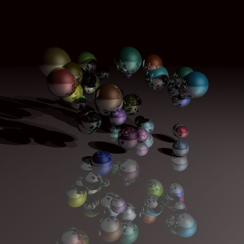

# Ray Tracing - LifProjet

  
Image d’une scène de notre application où l’on peut distinguer des sphères de différentes couleurs avec réflections sur les sphères et le sol.

### GROUPE
Constantin Magnin p1806593  
Alban Saint-Sorny p1804792  
Como Adrien       p1709079  

### Utilite
----

Permettre d'executer du lancer de rayon, sur des scènes composées d'objet simple (cube et sphere) en prenant en compte reflection, refraction.

### Installation et execution
----

Avoir un IDE utilisant CMakeList comme CLion et run à partir de l'IDE.

### Dependances
----

Ce code utilise QT : https://www.qt.io/download