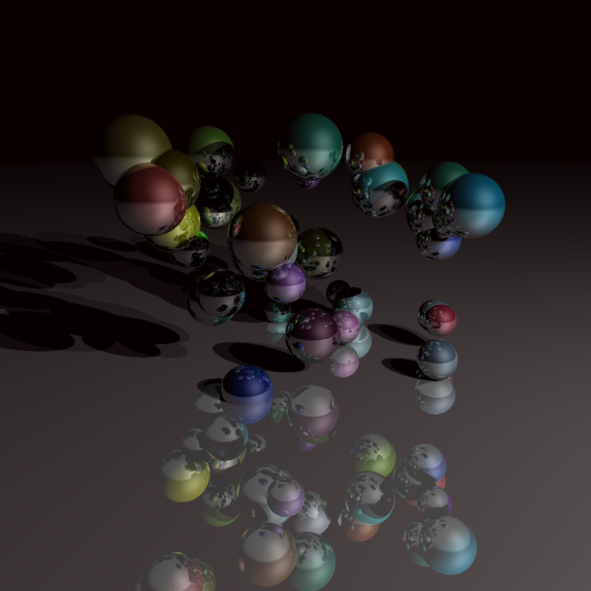
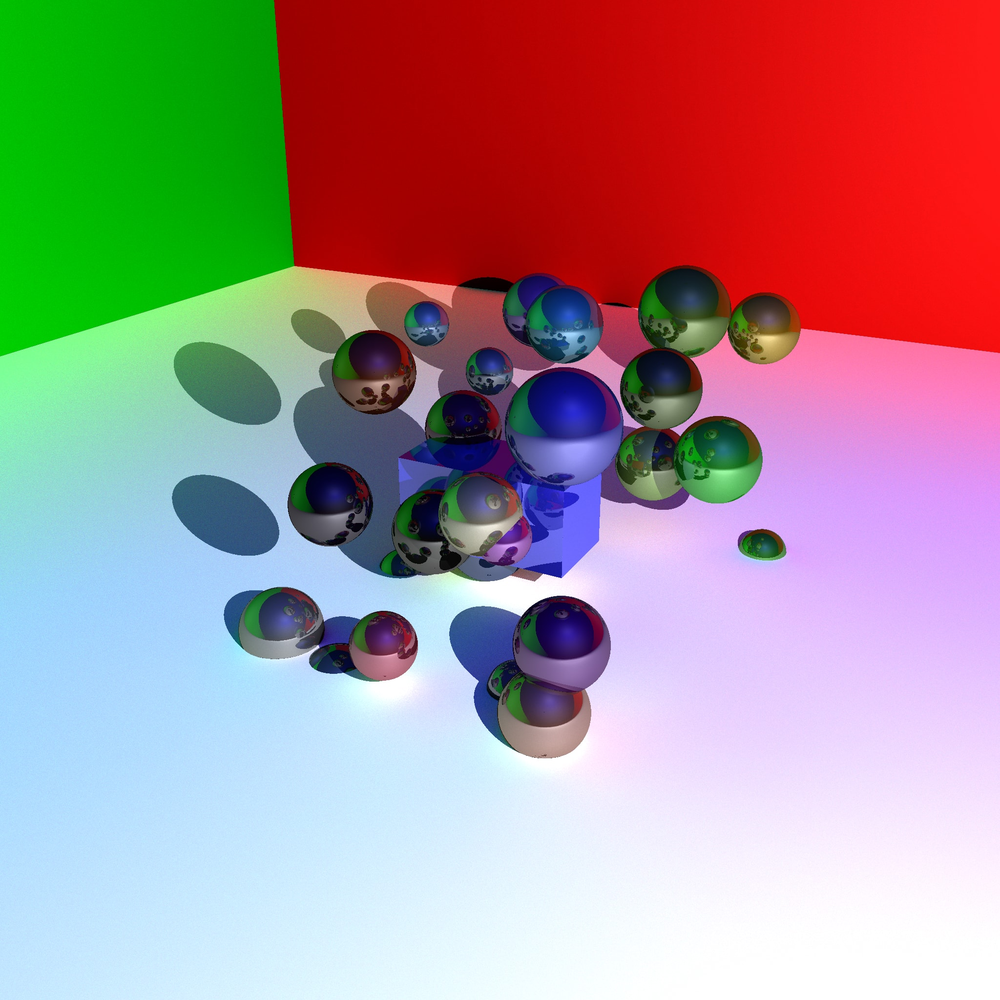
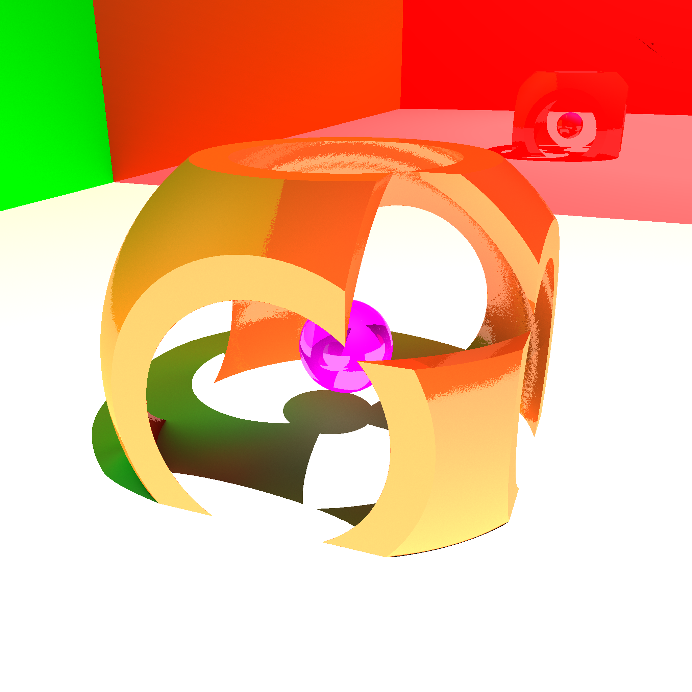

# Ray Tracing - LifProjet

  
Image d’une scène de notre application où l’on peut distinguer des sphères de différentes couleurs avec réflections sur les sphères et le sol.

### Presentation de l'agorithme de Ray-Tracing

Le Ray-Tracing est une technique permettant de générer une image en suivant le parcours de la lumière.  

Elle consiste à simuler le parcours inverse de la lumière : on calcule les éclairages de la caméra vers les objets puis vers les lumières, alors que dans la réalité la lumière va de la scène vers l'œil.  

Cette technique permet de produire des images de très haute qualité mais à un coût de calcul plus important que d’autre algorithme de calcul. 

### GROUPE
Constantin Magnin p1806593  
Alban Saint-Sorny p1804792  
Como Adrien       p1709079  

### Utilite
----

Permettre d'executer du lancer de rayon, sur des scènes composées d'objet simple ou complexes (cube, plan et sphere) en prenant en compte reflection, refraction, transparence et couleurs.

### Installation et execution
----

Avoir un IDE utilisant CMakeList comme CLion et run à partir de l'IDE.  
Lorsque l'application est ouverte, choisir la scène, choisir le niveau de détails grâce au slider, puis appuyer sur le bouton render.  
Nous pouvons acceder à la DepthMap grace au bouton Shading et Toggle View. 

### Dependances
----

Ce code utilise QT : https://www.qt.io/download

### Autre captures
----
  
  
  